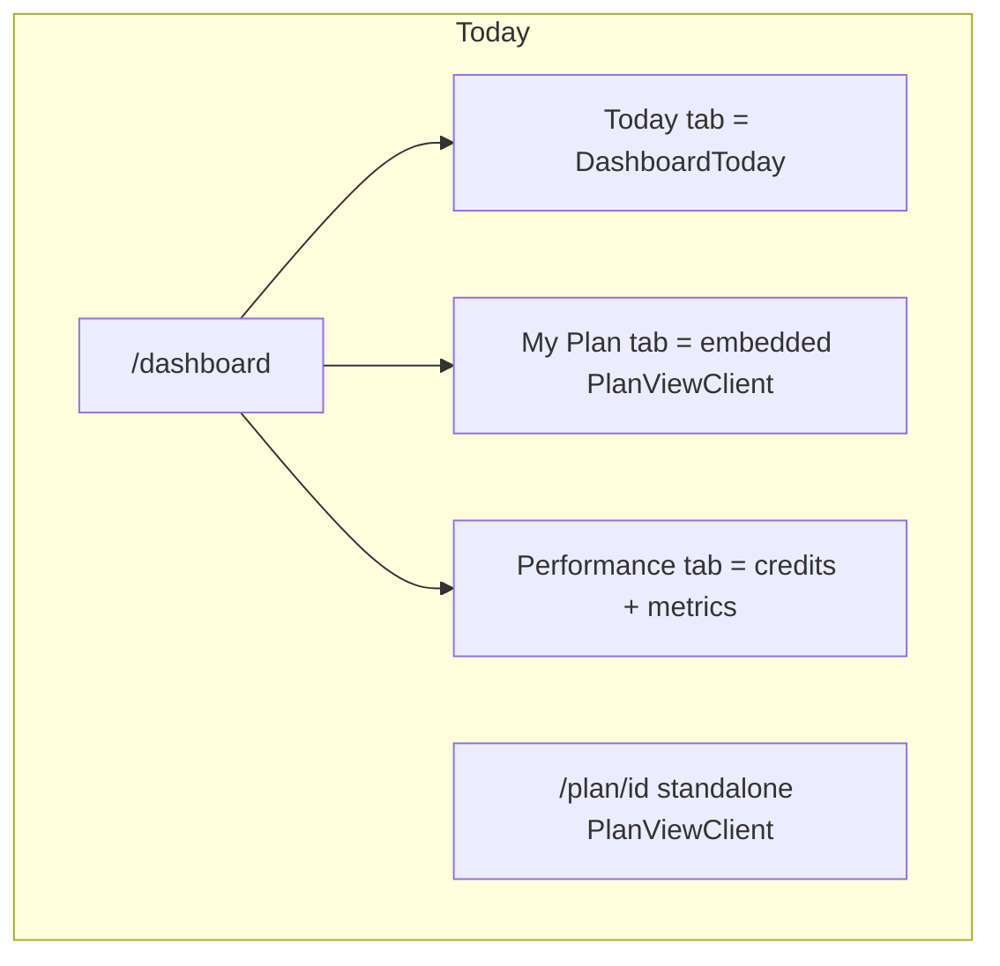
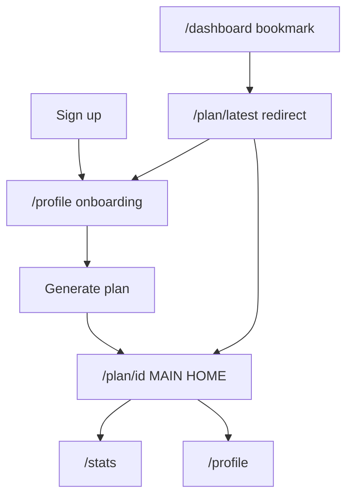
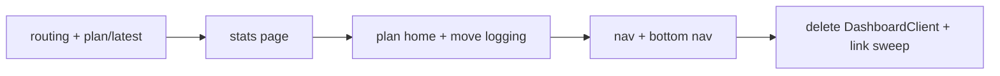

# Navigation & user-flow overhaul

## Current state (why it feels broken)



| Route | What it shows |
|-------|----------------|
| [`/dashboard`](app/dashboard/page.js) | 3 tabs: Today (meals + log), My Plan (duplicate full plan UI), Performance (stats) |
| [`/plan/[id]`](app/plan/[id]/page.js) | Same plan UI again (DayChips + SlotList + RecipePanel), not the default home |
| After signup | Auth callback → `/dashboard` if profile has `goal` ([`app/auth/callback/route.js`](app/auth/callback/route.js)) |
| After plan gen | Already → `/plan/[id]` ([`app/profile/page.js`](app/profile/page.js) L581) |

[`MobileBottomNav`](components/layout/MobileBottomNav.jsx) only exists on dashboard; it toggles **Today / My Plan** tabs (not real routes). [`Nav.js`](Nav.js) logo + links point to `/dashboard`.

**Features to preserve (where they live today):**

| Feature | Location today |
|---------|----------------|
| Day chips + meal slots + recipe panel | `PlanViewClient` (meals tab) |
| How to Cook / Ingredients / Market List (per day) | [`RecipePanel`](components/plan/RecipePanel.jsx) |
| Prep Guide / Wellness | `PlanViewClient` tabs |
| Log what I ate + AI adjust | [`DashboardClient`](components/DashboardClient.js) Today tab only |
| Swap meal / ingredient | `PlanViewClient` |
| Credits UI | Dashboard Performance tab + portal into Nav |
| Weekly shopping prices | `MarketPriceIndex` on Performance tab |

---

## Target architecture



| Route | Role |
|-------|------|
| `/profile` | Onboarding + edit profile + generate new plan |
| `/plan/[id]` | **Daily home** — today’s meals, 7-day navigation, recipe panel, logging |
| `/plan/latest` | Server redirect → newest plan id or `/profile` |
| `/stats` | **Stats only** (new URL; avoids conflict with dashboard redirect) |
| `/dashboard` | **301/redirect only** → `/plan/latest` or `/profile` (per your spec) |

**Mobile bottom nav (all authenticated app shells):** Plan → `/plan/latest` | Stats → `/stats` | Profile → `/profile`

**Header:** CleanEats logo | Credits badge | Avatar (no Dashboard/Profile text links on mobile)

---

## URL decision (resolves spec tension)

You asked for both “`/dashboard` becomes stats only” and “redirect `/dashboard` → `/plan/[id]`”. Recommended split:

- **`/stats`** = stats UI (label “Stats” in nav)
- **`/dashboard`** = redirect only (bookmarks and old links still work)

If you prefer stats to stay at `/dashboard`, drop the redirect and only change **default entry** URLs (auth, logo, middleware). The implementation below assumes **`/stats` + `/dashboard` redirect**.

---

## 1. `/plan/[id]` — primary screen

### Server page [`app/plan/[id]/page.js`](app/plan/[id]/page.js)

- Pass **`planId={row.id}`** (prop exists on `PlanViewClient` but is not passed today).
- Load **`profiles`** (tier, credits, `profile_data`, name).
- Load **`meal_logs`** for last 14 days (streak / optional “logged today” chips).
- On invalid plan: redirect `/profile` (not `/dashboard`).
- Optional: if `params.id !== latest` still allow view (history); logo always goes to latest.

### [`components/PlanViewClient.js`](components/PlanViewClient.js) (major)

**Remove `embedded` mode** after dashboard stops embedding it.

**Default “today” view:**

- Add `getTodayPlanDayIndex(startDateIso, planCreatedAt)` in [`lib/plan-dates.js`](lib/plan-dates.js) — use `plan_json.startDateIso` if present, else `plans.created_at` date.
- Initialize `selectedDayIndex` to today’s index (clamped 0–6), not always `0`.
- Top section when `selectedDayIndex === todayIndex`:
  - Eyebrow via `formatTodayEyebrow(location)`
  - Compact today meal list (reuse [`DashboardToday`](components/dashboard/DashboardToday.jsx) or slim variant)
  - **“Log what I ate”** button

**Move from `DashboardClient`:**

- Log modal + `submitLogWhatIAte` + `meal_logs` insert + optional AI adjust remaining meals ([`DashboardClient.js`](components/DashboardClient.js) ~L288–440).
- Extract to **`hooks/useMealLog.js`** or keep in plan client — same behavior, new home.

**Layout (keep existing strengths):**

- Day chips → all 7 days
- SlotList + RecipePanel (Ingredients / How to Cook / day Market List) — unchanged
- Tabs: Meal Plan (default) | Prep Guide | Wellness
- Trim or collapse macro banner on mobile (optional polish)

**Mobile recipe “slides in”:**

- Below `md`: selecting a meal opens RecipePanel in a **fixed bottom sheet / slide-over** (full width) with back affordance.
- `md+`: keep current two-column grid.

**Shell:**

- Full page: `<Nav />` + content + `<MobileBottomNav active="plan" planHref={/plan/${id}} />`
- Padding bottom for fixed nav (`pb-20` safe area)

---

## 2. `/stats` — stats only

### New [`app/stats/page.js`](app/stats/page.js) + [`components/StatsClient.js`](components/StatsClient.js)

Extract and extend Performance tab content from `DashboardClient`:

| Stat | Source |
|------|--------|
| Credits remaining | `profiles` + [`lib/credits.js`](lib/credits.js) (existing cards) |
| Calories hit this week | Sum `meal_logs.calories` for current week vs `plan_json.targetCalories * days` or adherence % |
| Protein average | `avg(meal_logs.protein_g)` this week |
| Current streak | Consecutive calendar days (local) with ≥1 `meal_logs` row |
| Link back to plan | Button → `/plan/latest` |
| Weekly shopping | Keep [`MarketPriceIndex`](components/dashboard/MarketPriceIndex.jsx) from latest plan `shoppingList` |

**Remove:** Today tab, My Plan tab, `PlanViewClient` embed, `DashboardToday`, log modal.

**Optional:** [`PerformanceMetrics`](components/dashboard/PerformanceMetrics.jsx) as secondary block (macro targets) — or drop to avoid duplicating plan page.

Server: fetch profile, latest plan json, meal_logs for week in `stats/page.js`.

---

## 3. Navigation cleanup

### [`components/layout/MobileBottomNav.jsx`](components/layout/MobileBottomNav.jsx)

Replace tab-toggle pattern with route links:

```js
{ id: 'plan', label: 'Plan', icon: CalendarDays, href: '/plan/latest' }
{ id: 'stats', label: 'Stats', icon: BarChart2, href: '/stats' }
{ id: 'profile', label: 'Profile', icon: User, href: '/profile' }
```

- `active` derived from `usePathname()` (`/plan/*` → plan, `/stats` → stats, `/profile` → profile).
- Remove `onTabChange` / `activeTab` props (breaking change for `DashboardClient` only).

### [`Nav.js`](Nav.js)

| Change | Detail |
|--------|--------|
| Logo href | `user ? '/plan/latest' : '/'` |
| Credits | Move [`NavTierCredits`](components/DashboardClient.js) into Nav or `components/layout/NavCredits.jsx`; accept `tier`, `creditsRemaining` props from page server data |
| Mobile | Hide “Dashboard” and “Profile” text links (`hidden sm:inline` → remove Dashboard link entirely; Profile only via avatar + bottom nav) |
| Avatar | Keep link to `/profile` |

Stop portaling credits from `DashboardClient` (delete that `useEffect` + `createPortal` pattern).

### New shared layout (optional but cleaner)

[`components/layout/AppShell.jsx`](components/layout/AppShell.jsx) — `Nav` + children + `MobileBottomNav` + credits props — used by `plan`, `stats`, `profile` pages.

---

## 4. Redirects & entry points

### New [`app/plan/latest/page.js`](app/plan/latest/page.js)

```text
auth user → query latest plans.id → redirect /plan/{id} or /profile if none
```

### [`app/dashboard/page.js`](app/dashboard/page.js)

Replace body with server redirect only (same logic as `/plan/latest`).

### Files to update (grep `/dashboard`)

| File | Change |
|------|--------|
| [`middleware.js`](middleware.js) | Logged-in `/login` `/signup` → `/plan/latest` not `/dashboard` |
| [`app/auth/callback/route.js`](app/auth/callback/route.js) | Complete profile → `/plan/latest` (fetch plan id), else `/profile` |
| [`app/login/page.js`](app/login/page.js) | Default `redirectTo` → `/plan/latest` |
| [`app/reset-password/page.js`](app/reset-password/page.js) | → `/plan/latest` |
| [`app/upgrade/page.js`](app/upgrade/page.js) | Back link → `/stats` or `/plan/latest` |
| [`app/page.js`](app/page.js), [`Hero.jsx`](components/landing/Hero.jsx), [`SignUpSection.jsx`](components/landing/SignUpSection.jsx) | Logged-in CTA → `/plan/latest` |
| [`app/plan/[id]/page.js`](app/plan/[id]/page.js) | Error redirect → `/profile` |
| [`components/dashboard/MealList.jsx`](components/dashboard/MealList.jsx) | Plan links stay `/plan/{id}` |

### Onboarding guard (recommended with this work)

- [`app/plan/latest/page.js`](app/plan/latest/page.js) and [`app/stats/page.js`](app/stats/page.js): if no `profile_data.goal` → `/profile`
- Prevents empty plan home for QR signups who skip onboarding

---

## 5. What gets deleted or gutted

| File | Action |
|------|--------|
| [`components/DashboardClient.js`](components/DashboardClient.js) | **Delete** after extracting log hook + stats into new files (~740 lines) |
| [`app/dashboard/page.js`](app/dashboard/page.js) | **Replace** with ~15-line redirect |
| `embedded` prop on `PlanViewClient` | **Remove** |

**Keep unchanged (reuse):** `DayChips`, `SlotList`, `RecipePanel`, `DashboardToday`, `MealCardBackground`, `useMealImages`, `PerformanceMetrics`, `MarketPriceIndex`.

---

## 6. Implementation order (minimize breakage)



1. **`/plan/latest` + `/dashboard` redirect + auth/middleware** — safe, no UI removal yet  
2. **`/stats` page** — parity with old Performance tab  
3. **`PlanViewClient` + plan page** — today index, logging, mobile nav, pass `planId`  
4. **`Nav` + `MobileBottomNav`** — wire credits on all shells  
5. **Remove `DashboardClient`** — delete duplicate tabs  
6. **QA:** generate plan → lands on `/plan/id`; bottom nav; log meal; swap; prep/market; stats; old `/dashboard` URL  

---

## 7. Risks and mitigations

| Risk | Mitigation |
|------|------------|
| Users bookmark `/dashboard` expecting stats | `/dashboard` → plan; stats at `/stats`; one-time comms |
| Multiple saved plans | `/plan/latest` always newest; keep `/plan/[id]` for explicit links |
| `startDateIso` missing on old plans | Fallback to `created_at` for “today” day index |
| Meal log only on dashboard today | Move hook before deleting `DashboardClient` |
| Credits badge regression | Pass credits from server on plan/stats/profile pages into Nav |
| Mobile recipe layout | Ship slide-over in same PR or fast follow |

---

## 8. Effort estimate

| Phase | Time |
|-------|------|
| Routing + redirects | 1–2 h |
| Stats page + meal_logs queries | 2–3 h |
| Plan home (today default + logging + bottom nav) | 3–4 h |
| Nav + mobile recipe drawer | 2–3 h |
| Link sweep + QA | 1–2 h |
| **Total** | **~1.5–2 days** |

**MVP cut (event-ready):** Phases 1–3 without mobile slide-over; reuse desktop recipe layout on mobile.

---

## 9. Out of scope (unless you ask)

- Forcing onboarding redirect on every route (only recommended guard above)
- Plan history UI / plan switcher
- Renaming `/profile` to `/onboarding`
- Changing plan generation flow (already redirects to `/plan/[id]`)

---

## Confirm before coding

1. **Stats URL:** `/stats` + `/dashboard` redirects to plan — OK?  
2. **“Today” on plan page:** Default day chip = calendar today + today header block — OK?  
3. **Mobile recipe:** Slide-over panel in v1 or fast follow?
